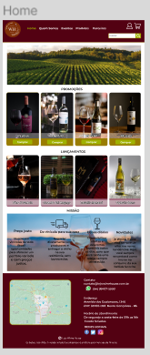

                        #PROJETO INTEGRADOR

##**Instituição de Ensino**: Digital House; 

##**Nome do projeto**: E-commerc de vinhos- Wine House;

 

##**Objetivos:

        - **Geral**: Praticar a teoria adquirida na sala da aula e desenvolver um site funcional.

        - **Específicos**:
        - Utilização da plataforma Figma , na construção de designer e protótipos do projeto.
         -Uso de  ferramentas como  o Node js, html, css, nodemon para eexecução do projeto;
         - Utilização do git e github;
         - Desenvolver soft skills,fundamental para a carreira profissional;

##Protótipo:
 Home:

#Página de produtos:

#Produto interno:

     

